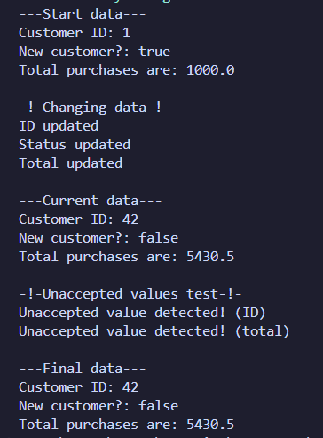

[](https://classroom.github.com/open-in-codespaces?assignment_repo_id=22355769)
# Лабораторна робота: Створення класів - Єдалов Артем 35 група

Друга лабораторна робота в курсі з ООП, в ході я маю отримати навички зі створення класів та тестування їх працездатності. Робота дуже маленька та складається з двох завдань.

## Завдання 1-2 + завдання на 5 балів. Створення класу з атрибутами та додавання в клас методів 

1. створіть **в пакеті ````domain````** клас ```` Сustomer ```` з такими **приватними атрибутами**:
    * ````ID```` (номер клієнта, **ціле** число)
    * ````isNew```` (статус клієнта новий він чи старий, **булевське** значення)
    * ````total```` (сума замовлень за рік, **дробове** число)
2. атрибути повинні мати **значення за замовчуванням** (наприклад, ````1```` для ````ID````, ````true```` для ````isNew````, ````1000```` для ````total````).
3. Додати до класу метод ````displayCustomerInfo````, який виводить на консоль інформацію про клієнта з допомогою ````System.out.println````. Кожен рядок має містити відповідну мітку, наприклад, "Total purchases are:" (див. перердню роботу).

```java
package domain;

public class Customer
{
    private int ID;
    private boolean isNew;
    private double total;

    public Customer()
    {
        ID = 1;
        isNew = true;
        total = 1000.0;
    }

    public void displayCustomerInfo()
    {
        System.out.println("Customer ID: " + ID);
        System.out.println("New customer?: " + isNew);
        System.out.println("Total purchases are: " + total);
    }

    public boolean setID(int nID)
    {
        if (nID < 0) return false;

        ID = nID;
        return true;
    }

    public void setStatus(boolean nStatus)
    { isNew = nStatus; }

    public boolean setTotal(double nTotal)
    {
        if (nTotal < 0 ) return false;

        total = nTotal;
        return true;
    }
}
```

## Перевірка працездатності створеного класу

1. Створити в **пакеті ````test````** клас ````CustomerTest````, в методі ````main```` якого створити об'єкт класу ```` Сustomer ```` та вивести на екран його властивості з допомогою методу ````displayCustomerInfo````.

```java
package test;

import domain.Customer;

public class CustomerTest
{
    public static void main(String[] args)
    {
        Customer customer = new Customer();

        System.out.println("---Start data---");
        customer.displayCustomerInfo();

        System.out.println("\n-!-Changing data-!-");
        
        if (customer.setID(42))
        { System.out.println("ID updated"); }
        
        customer.setStatus(false);
        System.out.println("Status updated");

        if (customer.setTotal(5430.50))
        { System.out.println("Total updated"); }

        System.out.println("\n---Current data---");
        customer.displayCustomerInfo();

        System.out.println("\n-!-Unaccepted values test-!-");
        
        if (!customer.setID(-10))
        { System.out.println("Unaccepted value detected! (ID)"); }
        
        if (!customer.setTotal(-500.0))
        { System.out.println("Unaccepted value detected! (total)"); }

        System.out.println("\n---Final data---");
        customer.displayCustomerInfo();
    }
}
```

2. **запустіть** його, зробіть та збережіть (тека **Solution**) у файл ````done.png```` **скріншот** результатів роботи програми

